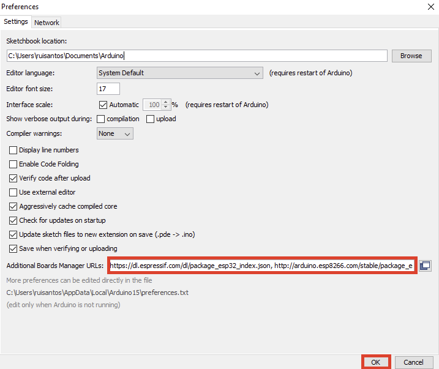

# Proyecto Balam 2021

## Guia de Instalación de Tarjeta ESP32 en Arduino IDE
### Pasos A Seguir:
1. Instalar Arduino IDE (no usar el zip)
2. Abrir ARDUINO IDE
3. Debemos ir a la pestaña ***Archivo***->***Preferencias***.
	- En la pestaña ***Ajustes*** buscamos la opción: ***Gestor de URLs Adicionales de Tarjetas: ***
	- Pegamos la siguiente URL: `https://dl.espressif.com/dl/package_esp32_index.json`
	- Luego precionamos la opción ***OK*** y automaticamente se cerrara la ventana.
4. Debemos ir a la pestaña ***Herramientas***->***Placa***->***Gestor de tarjetas***.
	- Colocamos en la barra de busqueda ***ESP32***.
	- Seleccionamos la opción que nos muestre ***esp32***.
	- Instalamos y luego precionamos la opción de ***Cerrar***.

Con esto tendremos completa la instalación de nuestra tarjeta ESP32 y lista para ser programada.	

5. Instalar el módulo del ESP32 en el gestor de tarjetas.
